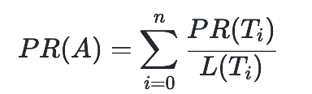
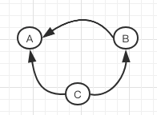
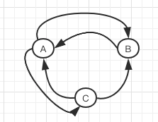
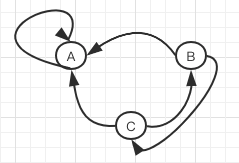
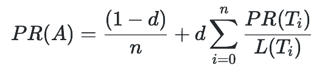
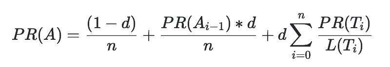

## 基本概念：
PageRank, 又名网页排名、PR，是以谷歌创始人之一的[拉里·佩奇](https://baike.baidu.com/item/%E6%8B%89%E9%87%8C%C2%B7%E4%BD%A9%E5%A5%87/4556608)命名的一种网页排名算法。该算法以网页之间超链接的个数和质量作为主要因素粗略的分析网页的重要性，其基本假设是：更重要的页面往往更多的被其他页面引用。比如可以把A页面含有的指向B页面的链接解释为“A页面给B页面投票”，并根据投票来源和投票对象权重来决定被投票页面的权重，简单来说，一个高权重页面可以提高其他页面页面权重。
  
PageRank算法是一种链接分析算法，它通过对超链接集合中的元素用数字进行权重赋值实现。我们将其中任意元素E的权重成为“E的PageRank”（The PageRank of E），用符号PR（E）表示。

- 数量假设<br>
  当在网页模型图中，一个网页接受到的其他网页的入链数越多说明该网页越重要。
- 质量假设<br>
  当一个质量高的网页指向一个网页，说明被指向的网页很重要。
- 入链和出链<br>
  当一个网页被别的网页引用，则该网页拥有一个出链；反过来呢如果当该网页被其他网页引用则称该网页拥有一个入链。
  图1中，A并不指向任何节点所以A的出链数为0，B和C指向A所以入链数为2，同理B的出链数为1入链数为1，C的出链数为2入链数为0.
  （此处有图）


## 算法和公式
PageRank基本算法可以使用如下的公式表示：



**PR(A)** 表示节点A的PR值;<br>
**PR(Ti)** 表示指向节点A的节点的PR值；<br>
**L(Ti)** 表示指向节点A的节点的出链数；<br>
**A** 表示需要计算PR值的节点<br>
**n** 表示节点个数<br>
**i** 表示循环次数。PR值需要通过多次迭代计算才能得出较稳定的值，每次一次迭代都是把上一次计算得到的PR值作为作为输入。i=0表示初始化，所有节点的PR值都是1/n<br>



为了简单处理我们以图1为例，将每次迭代计算出得结果写入表格：

|                          |PR(A) |PR(B) |PR(C) |
| :---                     |---   |---:  |---:  |
|i=0,<br>PR值初始化为1/n   |1/3   |1/3   | 1/3  |
|i=1                       |1/2   |1/6   | 0    |
|i=2                       |1/6   |0     |0     |
|i=3                       |0     |0     |0     |

n=0时所有节点PR均初始化为1/3；<br>
n=1时，由于A的入链有B和C，B的初始PR为1/3出链为1，C的初始PR为1/3出链为2，则
```
   PR(A)= PR(B)/L(B) + PR(C)/L(C)
        = 1/3 * 1 + 1/3 * 1/2
        = 1/2
```
同理可计算出B和C的PR值。<br>
n=2时，由于PR(C)=0最终计算得出PR(A)=1/6;<br>
n=3时，PR(A)=PR(B)=PR(C)=0<br>

### Dead Ends问题
上述示例中当i=3时所有的节点的PR值都等于0，这就是Dead Ends问题。
如果存在一个节点没有任何出链则会导致所有节点的PR值收敛于0。为了解决这个问题我们假设A节点访问B和C的概率都是1/2，A存在两条出链。更新图表1如下：



|                          |PR(A) |PR(B) |PR(C) |
| :---                     |---   |---:  |---:  |
|i=0,<br>PR值初始化为1/n   |1/3   |1/3   | 1/3  |
|i=1                       |3/6   |2/6   | 1/6  |
|i=2                       |5/12  |4/12  | 3/12 |
|i=3                       |11/24 |8/24  | 5/24 |


i=0时，所有节点PR值均初始化为1/3；<br>
i=1时，
```
PR(A) = 1/3 + 1/3 * 1/2       = 3/6
PR(B) = 1/3 * 1/2 + 1/3 * 1/2 = 2/6
PR(C) = 1/3 * 1/2             = 1/6
```
i=2时，
```
PR(A) = 2/6 + 1/6 * 1/2       = 5/12
PR(B) = 3/6 * 1/2 + 1/6 * 1/2 = 4/12
PR(C) = 3/6 * 1/2             = 3/12
```
i=3时，
```
PR(A) = 4/12 + 3/12 * 1/2       = 11/24
PR(B) = 5/12 * 1/2 + 3/12 * 1/2 = 8/24
PR(C) = 5/12 * 1/2              = 5/24
```
通过3次迭代计算三个节点的PR值逐渐接近，当然还可以继续迭代下去本文不再赘述。

### SpiderTraps问题
实际应用中还存在另一种问题，比如A节点有一条出链指向其本身，接下来我们推导该情形下PR值的变化。



|                          |PR(A) |PR(B) |PR(C) |
| :---                     |---   |---:  |---:  |
|i=0,<br>PR值初始化为1/n   |1/3   |1/3   | 1/3  |
|i=1                       |4/6   |1/6   | 1/6  |
|i=2                       |10/12 |1/12  | 1/12 |
|i=3                       |22/24 |1/24  | 1/24 |
|i=n                       |1     |0     | 0    |

i=0时，所有节点PR值均初始化为1/3；<br>
i=1时，
```
PR(A) = 1/3 + 1/3 * 1/2 + 1/3 * 1/2       = 4/6
PR(B) = 1/3 * 1/2                         = 1/6
PR(C) = 1/3 * 1/2                         = 1/6
```
i=2时，
```
PR(A) = 4/6 + 1/6 * 1/2 + 1/6 * 1/2       = 10/12
PR(B) = 1/6 * 1/2                         = 1/12
PR(C) = 1/6 * 1/2                         = 1/12
```
i=3时，
```
PR(A) = 10/12 + 1/12 * 1/2 + 1/12 * 1/2    = 22/24
PR(B) = 1/12 * 1/2                         = 1/24
PR(C) = 1/12 * 1/2                         = 1/24
```

## 公式
很明显最终A节点收敛于1而B，C节点的PR值收敛于0。为了解决以上问题对公式进行修正如下：



d 称为阻尼系数，一般介于0.8到0.9之间，表示页面自引用的概率。
当A的出链为0时，以上公式有如下形式：




修正之后，我们重新计算上述示例。
|                          |PR(A) |PR(B) |PR(C) |
| :---                     |---   |---:  |---:  |
|i=0,<br>PR值初始化为1/n   |1/3   |1/3   | 1/3  |
|i=1                       |0.62  |0.19  | 0.19 |
|i=2                       |0.74  |0.13  | 0.13 |
|i=3                       |0.78  |0.10  | 0.10 |

设阻尼系数为0.85。<br>
当i=1时，
```
PR(A) = (1-0.85) * 1/3 + 1/3 * 0.85 * 1/3 + 0.85 * (1/3 + 1/3 * 1/2 + 1/3 * 1/2) = 0.62
PR(B) = (1-0.85) * 1/3 + 0.85 * (1/3 * 1/2) = 0.19
PR(C) = (1-0.85) * 1/3 + 0.85 * (1/3 * 1/2) = 0.19
```
i=2时
```
PR(A) = (1-0.85) * 1/3 + 0.62 * 0.85 * 1/3 + 0.85 * (0.62 + 0.19 * 1/2 + 0.19 * 1/2) = 0.74
PR(B) = (1-0.85) + 0.85 * (0.19 * 1/2) = 0.13
PR(C) = (1-0.85) + 0.85 * (0.19 * 1/2) = 0.13
```
i=3时
```
PR(A) = (1-0.85) * 1/3 + 0.74 * 0.85 * 1/3 + 0.85 * (0.74 + 0.19 * 1/2 + 0.13 * 1/2) = 0.79
PR(B) = (1-0.85) + 0.85 * (0.13 * 1/2) = 0.10
PR(C) = (1-0.85) + 0.85 * (0.13 * 1/2) = 0.10
```

## 代码实现
实现代码采用比对前后两次执行结果的差值之和控制迭代次数，可设置变量```ε ```。代码在go语言中的实现如下。
```
/*
Package pagerank implements the *weighted* PageRank algorithm.
*/
package pagerank

import (
	"math"
)

type node struct {
	weight   float64
	outbound float64
}

// Graph holds node and edge data.
type Graph struct {
	edges map[string](map[string]float64)
	nodes map[string]*node
}

// NewGraph initializes and returns a new graph.
func NewGraph() *Graph {
	return &Graph{
		edges: make(map[string](map[string]float64)),
		nodes: make(map[string]*node),
	}
}

// Link creates a weighted edge between a source-target node pair.
// If the edge already exists, the weight is incremented.
func (self *Graph) Link(source, target string, weight float64) {
	if _, ok := self.nodes[source]; ok == false {
		self.nodes[source] = &node{
			weight:   0,
			outbound: 0,
		}
	}

	self.nodes[source].outbound += weight

	if _, ok := self.nodes[target]; ok == false {
		self.nodes[target] = &node{
			weight:   0,
			outbound: 0,
		}
	}

	if _, ok := self.edges[source]; ok == false {
		self.edges[source] = map[string]float64{}
	}

	self.edges[source][target] += weight
}

// Rank computes the PageRank of every node in the directed graph.
// α (alpha) is the damping factor, usually set to 0.85.
// ε (epsilon) is the convergence criteria, usually set to a tiny value.
//
// This method will run as many iterations as needed, until the graph converges.
func (self *Graph) Rank(α, ε float64, callback func(id string, rank float64)) {
	Δ := float64(1.0)
	inverse := 1 / float64(len(self.nodes))

	// Normalize all the edge weights so that their sum amounts to 1.
	for source := range self.edges {
		if self.nodes[source].outbound > 0 {
			for target := range self.edges[source] {
				self.edges[source][target] /= self.nodes[source].outbound
			}
		}
	}

	for key := range self.nodes {
		self.nodes[key].weight = inverse
	}

	for Δ > ε {
		leak := float64(0)
		nodes := map[string]float64{}

		for key, value := range self.nodes {
			nodes[key] = value.weight

			if value.outbound == 0 {
				leak += value.weight
			}

			self.nodes[key].weight = 0
		}

		leak *= α

		for source := range self.nodes {
			for target, weight := range self.edges[source] {
				self.nodes[target].weight += α * nodes[source] * weight
			}

			self.nodes[source].weight += (1-α)*inverse + leak*inverse
		}

		Δ = 0

		for key, value := range self.nodes {
			Δ += math.Abs(value.weight - nodes[key])
		}
	}

	for key, value := range self.nodes {
		callback(key, value.weight)
	}
}

// Reset clears all the current graph data.
func (self *Graph) Reset() {
	self.edges = make(map[string](map[string]float64))
	self.nodes = make(map[string]*node)
}
```

example 代码样例：
```
/*
Package pagerank implements the *weighted* PageRank algorithm.
*/
package pagerank

import (
	"fmt"
	"testing"
)

// test rank, set damp is 0.85
// run with "go test -v pagerank_test.go pagerank.go"
func TestGraph_Rank(t *testing.T) {
	graph := NewGraph()
	graph.Link("b", "a", 1)
	graph.Link("b", "c", 1)
	graph.Link("c", "b", 1)
	graph.Link("c", "a", 1)
	graph.Link("a", "a", 1)

	// gap with last result should less than 0.01
	graph.Rank(0.85, 0.01, callback)
}

func callback(key string, weight float64){
	fmt.Println(key, ":", weight)
}
```
